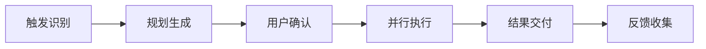

# Background-agent-spec

<div align="center">


**AI代理人机协作并行工作流的统一规约标准**

[规约文档](docs/specs/spec.backgroundAgent.README.md) • [快速开始](#快速开始) • [贡献指南](#贡献与反馈) • [更新日志](#版本信息)

</div>

## 📖 简介

Background-agent-spec 是一套完整的 **Background Agent规约标准**，为各种AI代理（Claude、Gemini、Cursor等）提供统一的人机协作并行工作流框架。通过标准化的规约体系，确保不同AI代理都能提供一致、高效、可控的协作体验。

### ✨ 主要特性

- 🎯 **统一标准** - 为不同AI代理提供一致的工作流框架
- ⚡ **高效执行** - 支持并行任务调度和智能状态管理  
- 🔒 **可控透明** - 完整的确认机制与可追溯的执行过程
- 🔄 **持续改进** - 基于反馈的流程优化和版本化演进

## 🚀 快速开始

### 基础概念

Background Agent工作流通过以下关键词触发：

```bash
# 新建任务规划
"BGA帮我重构这个项目，包括代码优化、文档更新和测试完善"

# 执行已有规划
"执行P001"

# 查看执行状态  
"P001执行情况如何？"

# 提供反馈
"对P001的执行结果有以下建议..."
```

### 标准工作流



### 文件结构规范

```
todos/P00X/
├── plan.json          # 规划配置与文件引用
├── todolist.md        # 任务清单与状态跟踪
├── rationale.md       # 执行理由与逻辑说明
├── feedback.md        # 多方反馈记录
└── reports/           # 执行报告与历史记录
    └── exec_001_YYYY-MM-DD_HH-mm.md
```

## 📋 支持的AI代理

| 类型 | 代理 | 状态 |
|------|------|------|
| **Claude系列** | Claude Code, Claude API, Claude Sonnet | ✅ 支持 |
| **Google系列** | Gemini CLI, Gemini Pro, Bard | ✅ 支持 |
| **开发工具** | Cursor, GitHub Copilot, CodeT5 | ✅ 支持 |
| **开源模型** | LLaMA, ChatGLM, 通义千问 | ✅ 支持 |
| **自定义代理** | 基于OpenAI API、Azure API等 | ✅ 支持 |

## 🛠️ 集成实现

### 对AI代理开发者

1. **阅读规约文档** - 查看完整的[技术规约说明](docs/specs/spec.backgroundAgent.README.md)
2. **选择实现方式** - 根据代理特性选择适合的集成方法
3. **核心流程实现** - 确保实现触发、规划、执行、反馈的完整流程
4. **标准格式遵循** - 按照规约要求实现文件格式和状态管理

### 对用户

1. **学习触发方式** - 掌握关键词触发和工作流概念
2. **协作操作** - 学习规划确认、状态查询、反馈提供等操作
3. **最佳实践** - 了解如何与支持此规约的AI代理高效协作

## 📚 文档结构

```
Background-agent-spec/
├── README.md                              # 项目概述与集成指南
└── docs/
    └── specs/
        └── spec.backgroundAgent.README.md # 完整规约技术文档 (1115行)
```

## 🔄 版本信息

| 项目 | 版本 | 状态 | 发布日期 |
|------|------|------|----------|
| **Background-agent-spec** | v0.1.0 | 初始版本 | 2025-08-02 |
| **规约框架** | v1.3.0 | 稳定版 | 2025-07-29 |

## 🤝 贡献与反馈

我们欢迎社区的参与和贡献：

- 🔧 **AI代理开发者** - 提供实现反馈和改进建议
- 👥 **用户** - 分享使用体验和功能需求  
- 🌟 **社区** - 贡献最佳实践和扩展方案

### 如何贡献

1. Fork 本仓库
2. 创建特性分支 (`git checkout -b feature/AmazingFeature`)
3. 提交更改 (`git commit -m 'Add some AmazingFeature'`)
4. 推送到分支 (`git push origin feature/AmazingFeature`)
5. 创建 Pull Request

## 📄 许可证

本项目采用MIT许可证，鼓励各AI代理厂商和开发者基于此规约构建标准化的协作体验。

## 🏷️ 标签

`ai-agent` `workflow` `specification` `automation` `collaboration` `background-agent`

---

<div align="center">

**Background-agent-spec v0.1.0** - *让AI代理协作更标准、更高效*

Made with ❤️ for the AI agent community

</div>
