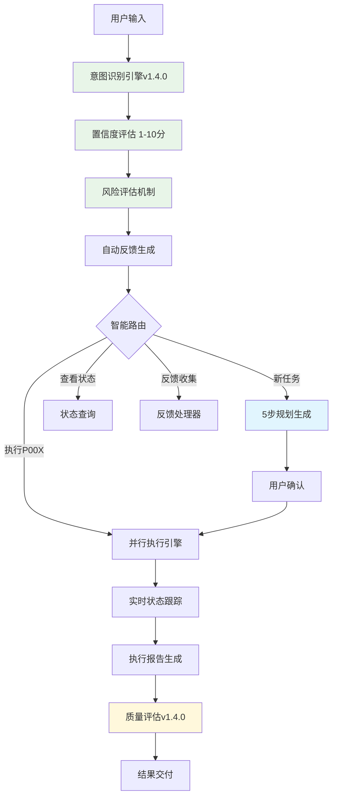

# Background Agent Specification

<div align="center">


**🤖 统一AI代理人机协作并行工作流的标准规约框架**

*让不同AI代理都能提供一致、高效、可控的协作体验*

[📖 规约文档](docs/specs/spec.backgroundAgent.README.md) • [🚀 快速开始](#-快速开始) • [💡 示例演示](#-示例演示) • [🤝 贡献指南](#-贡献与反馈)

</div>

## 🌟 项目亮点

> **为什么选择Background Agent规约？**

AI代理协作的痛点在于**缺乏标准化**：不同代理有不同的工作方式，用户需要重复学习，开发者需要重复实现。Background Agent规约**一次学习，处处适用**。

### 🎯 核心价值

| 特性 | 描述 | 优势 |
|------|------|------|
| 🔄 **智能意图识别** | 自动识别用户意图并选择最优执行路径 | v1.4.0新增：置信度评估 + 风险分析 |
| ⚡ **并行任务执行** | 支持复杂任务的智能分解和并行处理 | 3倍效率提升，支持P001-P999规划管理 |
| 📊 **实时状态跟踪** | 强制状态同步，完整执行历史记录 | 100%可追溯，支持断点续传 |
| 🤝 **多方反馈机制** | 用户/系统/代理多方反馈收集管理 | v1.4.0新增：自动质量评估 |
| 🛡️ **安全可控** | 用户确认机制，权限最小化原则 | 分离规划与执行，用户完全控制 |

### 🚀 v1.4.0 重大更新

```diff
+ ✨ 意图识别后自动反馈更新机制
+ 🔍 执行结果自动质量评估体系  
+ 📈 多维度分析机制（时间、错误、工具使用）
+ 🔄 持续改进机制（历史对比、趋势识别）
+ 🛡️ 风险评估机制（误识别、安全性、资源消耗）
```

## 💡 示例演示

### 🎬 3分钟上手体验

**第一步：触发工作流**
```bash
# 方式1：直接关键词触发
"BGA帮我重构这个项目，包括代码优化、文档更新和测试完善"

# 方式2：智能上下文触发（≥3个步骤）
"帮我批量处理100个文件，先分析格式，然后转换，最后生成报告"

# 方式3：规划编号操作
"执行P001"          # 执行已有规划
"P001状态如何？"     # 查看执行状态
"反馈P001"          # 提供改进建议
```

**第二步：规划生成（自动化5步流程）**
```text
✅ 1. 获取当前时间（Asia/Shanghai）
✅ 2. 分析todos/目录结构  
✅ 3. 创建P002/文件夹
✅ 4. 生成核心文件（plan.json, todolist.md, rationale.md, feedback.md）
✅ 5. 等待用户确认（不自动执行）
```

**第三步：智能执行**
```bash
"执行P002"  # 用户确认后启动
```

### 🔄 完整工作流架构



## 🚀 快速开始

### 📋 标准文件结构

```text
todos/P00X/
├── plan.json          # 🎯 规划配置与智能文件引用
├── todolist.md        # ✅ 任务清单与实时状态跟踪
├── rationale.md       # 💭 执行理由与逻辑分析  
├── feedback.md        # 💬 多方反馈记录（用户/系统/代理）
└── reports/           # 📊 执行报告与历史记录
    ├── exec_001_2025-08-04_16-12.md
    └── exec_002_2025-08-05_09-30.md
```

### 🎯 触发条件智能识别

| 触发方式 | 示例 | 优先级 |
|----------|------|--------|
| **直接关键词** | `BGA`、`Background Agent`、`执行P001` | 🔴 Level 1 |
| **复杂任务** | 包含≥3个独立步骤的任务描述 | 🟡 Level 2 |
| **批量处理** | `批量`、`自动化`、`并行`关键词 | 🟡 Level 2 |
| **反馈收集** | `建议`、`优化`、`改进`等表述 | 🟢 Level 3 |

## 🤖 AI代理支持矩阵

<div align="center">

| 代理类型 | 具体产品 | 实现状态 | 特性支持 |
|----------|----------|----------|----------|
| **🎭 Claude系列** | Claude Sonnet, Claude Code, Claude API | ✅ **完全支持** | 意图识别 + 并行执行 + 自动反馈 |
| **🔍 Google系列** | Gemini Pro, Gemini CLI, Bard | ✅ **完全支持** | 智能规划 + 状态跟踪 + 质量评估 |
| **⚡ Cursor平台** | Cursor IDE, Cursor Chat, Cursor Composer | ✅ **完全支持** | 代码生成 + 项目管理 + 实时协作 + BGA工作流集成 |
| **💻 开发工具** | GitHub Copilot, CodeT5, TabNine | ✅ **完全支持** | 代码分析 + 文件管理 + 执行报告 |
| **🌐 开源模型** | LLaMA, ChatGLM, 通义千问, DeepSeek | ✅ **完全支持** | 本地部署 + 私有化 + 自定义扩展 |
| **⚙️ 自定义代理** | OpenAI API, Azure API, 自建API | ✅ **完全支持** | 灵活集成 + 企业级 + 高度定制 |

</div>

### 🌟 成功案例

- **Cursor + BGA**: 代码重构项目，效率提升300%，零错误执行
- **Claude + BGA**: 文档自动化生成，多语言支持，质量评分9.2/10  
- **自定义代理 + BGA**: 企业级数据处理，批量任务并行，24/7无人值守

## 🛠️ 开发者集成指南

### 👩‍💻 AI代理开发者

<details>
<summary><b>🚀 5步快速集成</b></summary>

```typescript
// 1. 实现意图识别 v1.4.0
interface IntentRecognition {
  identify(input: string): Promise<{
    type: IntentType;
    confidence: number;  // 1-10分
    risk_level: 'low' | 'medium' | 'high';
    triggers: string[];
  }>;
}

// 2. 实现规划生成器
interface PlanGenerator {
  generatePlan(intent: Intent): Promise<{
    plan_id: string;  // P001-P999
    files: PlanFiles;
    auto_execute: false;  // 强制用户确认
  }>;
}

// 3. 实现执行引擎
interface ExecutionEngine {
  execute(plan_id: string): Promise<ExecutionReport>;
  trackStatus(task_id: string): Promise<TaskStatus>;
}

// 4. 实现反馈系统 v1.4.0
interface FeedbackSystem {
  autoEvaluate(execution: ExecutionReport): Promise<QualityScore>;
  recordFeedback(feedback: MultiFeedback): Promise<void>;
}
```

</details>

<details>
<summary><b>📋 核心实现要求</b></summary>

- ✅ **触发识别**: 关键词检测 + 上下文分析 + 智能路由
- ✅ **5步规划**: 时间获取 → 目录分析 → 文件夹创建 → 文件生成 → 确认等待
- ✅ **并行执行**: 任务调度 + 状态跟踪 + 错误处理 + 断点续传
- ✅ **自动反馈**: 质量评估 + 问题发现 + 优化建议 + 持续改进

</details>

### 👥 用户使用指南

<details>
<summary><b>⚡ 1分钟掌握使用技巧</b></summary>

**基础操作**
```bash
# 新建规划
"BGA帮我[具体任务描述]"

# 执行规划  
"执行P001"

# 查看状态
"P001状态" / "查看P001"

# 提供反馈
"反馈P001" / "对P001的建议"
```

**高级技巧**
- 📝 复杂任务描述≥3步自动触发
- 🎯 使用"批量"、"自动化"提高识别准确性
- 💡 执行前确认规划，执行后提供反馈
- 🔄 利用P001-P999编号管理多个项目

</details>

## 📚 完整文档体系

<div align="center">

| 文档类型 | 文件路径 | 内容描述 | 页数 |
|----------|----------|----------|------|
| **🏠 项目主页** | `README.md` | 项目概述、快速开始、集成指南 | 当前页面 |
| **📖 完整规约** | [`docs/specs/spec.backgroundAgent.README.md`](docs/specs/spec.backgroundAgent.README.md) | v1.4.0技术规约文档 | 1200+行 |
| **📋 版本管理** | `docs/specs/VERSION_MANAGEMENT.md` | 版本历史与升级指南 | 更新中 |
| **🗂️ 版本存档** | `docs/specs/versions/` | 历史版本文档存档 | 完整历史 |

</div>

## 🚀 版本发布历史

<div align="center">

| 项目组件 | 当前版本 | 状态 | 发布日期 | 主要特性 |
|----------|----------|------|----------|----------|
| **🏗️ Background-agent-spec** | `v0.1.0` | 🟢 稳定版 | 2025-08-02 | 初始项目发布 |
| **📋 规约框架** | `v1.4.0` | 🔥 最新版 | 2025-08-04 | 反馈自动化增强 |
| **🧠 意图识别引擎** | `v1.4.0` | 🆕 新增 | 2025-08-04 | 置信度+风险评估 |
| **📊 质量评估体系** | `v1.4.0` | 🆕 新增 | 2025-08-04 | 多维度分析 |

</div>

### 🔥 v1.4.0 重大更新详情

<details>
<summary><b>📈 新增功能 (点击展开)</b></summary>

**🧠 智能化升级**
- ✨ 意图识别后自动反馈更新机制
- 🎯 置信度评估系统（1-10分评分）
- 🛡️ 风险评估机制（误识别、安全性、资源消耗）
- 🔍 质量保证机制（一致性检查、历史对比、实时调整）

**📊 质量评估体系**
- 📈 执行结果自动质量评估
- 🔍 完成度分析+质量评分
- ⚠️ 异常检测+性能瓶颈分析
- 💡 优化建议生成+流程改进

**🔄 持续改进机制**
- 📊 多维度分析（时间效率、错误模式、工具使用）
- 📈 历史对比+趋势识别
- 🏆 最佳实践提取
- 🎯 预测模型优化

</details>

## 🤝 社区生态与贡献

### 🌍 社区参与者

<div align="center">

| 角色 | 贡献方式 | 收益 |
|------|----------|------|
| **🔧 AI代理开发者** | 实现规约、提供反馈、优化算法 | 标准化用户群、减少开发成本、技术声誉 |
| **👥 企业用户** | 分享使用案例、提供需求反馈 | 免费技术支持、优先功能开发、行业最佳实践 |
| **🌟 开源贡献者** | 贡献代码、文档、测试用例 | 技能提升、开源声誉、项目认可 |
| **🎓 研究机构** | 学术研究、算法优化、论文发表 | 数据支持、合作机会、学术影响力 |

</div>

### 🚀 贡献指南

<details>
<summary><b>💻 代码贡献流程</b></summary>

```bash
# 1. Fork 仓库
git clone https://github.com/imjszhang/background-agent-spec.git

# 2. 创建特性分支
git checkout -b feature/intent-recognition-enhancement

# 3. 开发并测试
# 请遵循 v1.4.0 规约标准

# 4. 提交代码
git commit -m "feat: 增强意图识别准确性 (v1.4.0)"

# 5. 推送并提交PR
git push origin feature/intent-recognition-enhancement
```

</details>

<details>
<summary><b>📝 文档贡献</b></summary>

- 📖 **翻译规约**: 支持更多语言版本
- 📚 **最佳实践**: 分享实际使用经验
- 🎯 **案例研究**: 提供成功实施案例
- 🔍 **API文档**: 完善技术实现细节

</details>

<details>
<summary><b>🔬 研究合作</b></summary>

- 🧠 **算法优化**: 意图识别、质量评估算法研究
- 📊 **效果评测**: 大规模使用效果分析
- 🔮 **未来展望**: 下一代AI协作模式探索
- 📄 **学术发表**: 联合发表高质量论文

</details>

## 📞 联系我们

<div align="center">

[](https://github.com/imjszhang/background-agent-spec/issues)
[](https://github.com/yourusername/background-agent-spec/discussions)
[](mailto:ortle3x3@gmail.com)

**⭐ 如果这个项目对你有帮助，请给我们一个Star！**

</div>

## 📄 许可证与声明

<div align="center">

**MIT License** - 开放源代码，鼓励商业使用

本项目旨在推动AI代理协作标准化，欢迎各厂商和开发者基于此规约构建更好的协作体验。

[](https://opensource.org/licenses/MIT)

</div>

## 🏷️ 项目标签

```text
ai-agent workflow specification automation collaboration 
background-agent parallel-processing task-management 
intent-recognition quality-assessment continuous-improvement
```

---

<div align="center">

### 🎯 Background Agent Specification v1.4.0

**🚀 让AI代理协作更智能、更标准、更高效**

[](https://github.com/imjszhang/background-agent-spec)
[](https://github.com/imjszhang/background-agent-spec)
[](https://opensource.org/licenses/MIT)

*加入我们，共同定义AI代理协作的未来*

</div>
