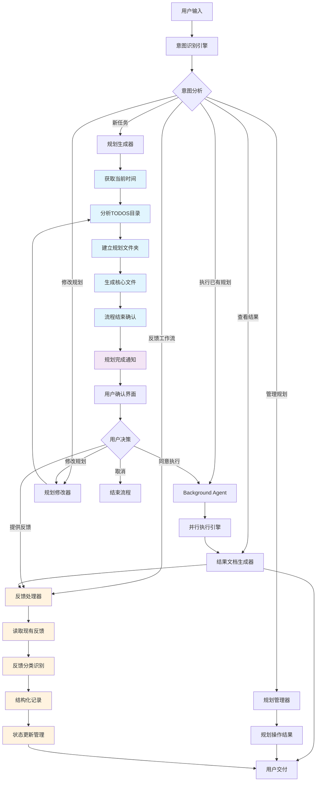

# Background Agent 人机协作并行工作流的规范说明

## 版本信息
- **当前版本**: v1.3.0
- **发布日期**: 2025-07-29
- **版本状态**: 稳定版 (Stable)  
- **兼容性**: 向后兼容v1.2.0

## 概述

Background Agent(简称BGA) 是一个智能协作系统，旨在实现人与AI Agent之间的高效并行工作流。通过结构化的任务规划、确认机制和执行流程，确保任务的准确性和可追溯性。

## 工作流触发条件

### 1. 关键词触发
用户输入包含以下任一关键词时自动触发工作流：

**主要触发词**：
- `BGA` / `bga` - 直接引用Background Agent
- `Background Agent` - 完整名称
- `后台代理` / `后台助手` - 中文名称

**动作触发词**：
- `执行` + 规划编号（如"执行P001"）
- `运行` + 规划编号（如"运行P002"）
- `启动` + 规划编号（如"启动P003"）

**查询触发词**：
- 规划编号 + `状态`/`进度`/`结果`（如"P001状态"、"P002进度"）
- `查看` + 规划编号（如"查看P001"）

**反馈触发词**：
- `反馈` + 规划编号（如"反馈P001"、"P002反馈"）
- `建议` + 规划编号（如"建议P001"、"对P002的建议"）
- `评价` + 规划编号（如"评价P001执行结果"）
- `优化` + 规划编号（如"优化P002"）

### 2. 上下文触发
即使未明确提及BGA，以下情况也会触发工作流：

**任务规划场景**：
- 用户描述复杂的多步骤任务
- 包含"帮我规划"、"制定计划"等表述
- 任务描述超过3个独立步骤

**批量处理场景**：
- 涉及大量文件或数据处理
- 包含"批量"、"自动化"、"并行"等关键词
- 需要长时间执行的任务

**项目管理场景**：
- 包含时间规划、资源分配的描述
- 涉及多个文件或模块的操作
- 需要生成报告或文档的任务

**反馈收集场景**：
- 包含"有什么建议"、"如何改进"、"优化方案"等表述
- 涉及对执行结果的评价和改进
- 需要记录多方意见的任务

### 3. 智能识别机制

系统通过以下方式进行智能判断：

**任务复杂度分析**：
- 步骤数量：≥3个独立步骤
- 预估时间：≥5分钟的执行时间
- 文件操作：涉及≥5个文件的操作

**语义分析**：
- 识别任务分解需求
- 检测并行执行可能性
- 判断是否需要状态跟踪

**用户意图强度**：
- 明确的执行指令（高优先级触发）
- 探索性询问（低优先级触发）
- 紧急任务标识（立即触发）
- 反馈收集意图（中优先级触发）

### 4. 触发示例

#### ✅ 会触发工作流的输入示例：

**直接触发**：
- "BGA执行P001"
- "用Background Agent帮我处理这个任务"
- "P002的执行状态如何？"
- "反馈P001的执行结果"
- "对P002有什么建议？"

**上下文触发**：
- "帮我批量处理这100个文件，需要先分析格式，然后转换，最后生成报告"
- "我要做一个复杂的数据迁移项目，包括备份、转换、验证、部署等步骤"
- "制定一个自动化测试计划，涵盖单元测试、集成测试和性能测试"

**智能识别触发**：
- "分析所有用户数据，生成季度报告，并发送给各部门负责人"
- "重构整个项目结构，更新依赖，修复已知bug，并更新文档"

**反馈工作流触发**：
- "收集大家对这个项目的意见和建议"
- "系统运行有什么可以优化的地方吗？"
- "执行结果如何，有什么改进建议？"

#### ❌ 不会触发工作流的输入示例：

**简单查询**：
- "什么是Background Agent？"
- "如何使用BGA？"

**单步任务**：
- "帮我写个Hello World程序"
- "查看某个文件的内容"

**普通对话**：
- "今天天气怎么样？"
- "解释一下这个概念"

### 5. 触发优先级与处理策略

#### 触发优先级（从高到低）：

**Level 1 - 立即触发**：
- 明确包含BGA关键词的指令
- 指定规划编号的执行/查询请求
- 标记为紧急的任务

**Level 2 - 高优先级触发**：
- 复杂多步骤任务描述
- 批量处理需求
- 项目管理场景

**Level 3 - 智能判断触发**：
- 基于任务复杂度分析
- 语义分析结果
- 上下文相关性评估

#### 处理策略：

**确认机制**：
- Level 1：直接执行，无需额外确认
- Level 2：简要确认后执行
- Level 3：详细确认用户意图后决定是否触发

**误触发保护**：
- 提供"这不是我想要的"快速退出选项
- 支持触发后的流程中断
- 记录用户反馈以优化识别算法

## 工作流程

### 1. 用户意图识别

系统首先对用户的输入进行深度分析，识别用户的真实意图和需求：

- **语义理解**：解析用户描述中的关键信息
- **目标提取**：明确用户希望达成的具体目标
- **约束条件识别**：识别任务执行中的限制条件和要求
- **优先级判断**：评估任务的紧急程度和重要性

#### 意图识别后的流程分支

根据用户意图的不同，系统会智能选择进入相应的流程：

**1. 新任务规划**
- **触发条件**：用户描述新的需求或任务，且未指定现有规划编号
- **关键词识别**：包含任务描述、目标设定等内容
- **流程路径**：进入流程2（生成带编号的规划），严格按照五步流程执行：
  1. 获取当前时间 → 2. 分析TODOS目录 → 3. 建立规划文件夹 → 4. 生成核心文件 → 5. 流程结束（不执行）

**2. 执行已有规划**
- **触发条件**：用户明确提到规划编号（如"执行P001"、"BGA P002"）
- **前置验证**：检查规划是否存在、状态是否允许执行
- **流程路径**：通过验证后直接进入流程4（Background Agent执行）

**3. 查看执行结果**
- **触发条件**：用户询问规划状态或执行结果（如"P001执行情况"、"查看P002报告"）
- **关键词识别**：状态查询、结果查看、报告查询等
- **流程路径**：直接进入流程5/6（结果文档查看/交付）

**4. 修改现有规划**
- **触发条件**：用户要求调整已有规划（如"修改P001"、"调整P002的任务3"）
- **前置验证**：检查规划是否存在、是否正在执行中
- **流程路径**：进入流程3A（规划修改确认机制）

**5. 规划管理**
- **触发条件**：列出规划、删除规划、重命名规划等管理操作
- **关键词识别**：列出、删除、查看所有、管理等
- **流程路径**：直接操作todos文件夹并返回结果

**6. 反馈工作流**
- **触发条件**：用户提供反馈、请求收集反馈、评价执行结果（如"反馈P001"、"收集建议"）
- **关键词识别**：反馈、建议、评价、优化、改进等
- **流程路径**：读取现有feedback.md，记录新反馈，更新反馈状态

### 2. 生成带编号的规划并保存（仅限新任务）

基于用户意图，系统生成详细的执行规划。**新任务规划流程必须严格按以下步骤执行**：

#### 第一步：获取当前时间
- **强制要求**：使用`mcp_time_get_current_time`工具获取准确的当前时间
- **时区设置**：默认使用"Asia/Shanghai"时区
- **时间用途**：
  - 规划创建时间戳
  - 文件命名时间标识
  - 执行时间规划基准

#### 第二步：分析TODOS目录结构
- **强制要求**：使用`list_dir`工具扫描`todos/`目录
- **分析内容**：
  - 现有规划数量统计
  - 已使用的规划编号识别
  - 目录结构完整性检查
  - 存储空间可用性评估
- **编号生成逻辑**：
  - 扫描现有P001-P999编号，找到下一个可用编号
  - 处理编号冲突和跳号情况
  - 确保编号的唯一性和连续性

#### 第三步：建立新规划文件夹结构
- **文件夹创建**：在`todos/`目录下创建新的规划文件夹（如`P004/`）
- **标准目录结构**：
```
todos/P00X/
├── plan.json          # 规划配置文件
├── todolist.md        # 任务清单文件
├── rationale.md       # 执行理由文件
├── user_feedback.md   # 用户反馈文件
└── reports/           # 执行报告目录
```

#### 第四步：生成核心规划文件
按以下顺序依次生成规划相关的核心文件：

**1. plan.json生成**：
- **内容要求**：完整的规划配置、任务分解和相关文件引用
- **时间戳设置**：使用第一步获取的准确时间
- **文件关联**：自动识别项目中与任务相关的文件并填充referenced_files字段
- **状态初始化**：设置为"pending"状态

**2. todolist.md生成**：
- **格式要求**：标准Markdown任务列表格式
- **状态标记**：所有任务初始状态为`[ ]`（待执行）
- **任务编号**：按序号组织任务列表
- **依赖关系**：明确标注任务间的依赖关系

**3. rationale.md生成**：
- **内容要求**：详细说明每个任务的执行理由和逻辑
- **技术分析**：包含技术实现路径和风险评估
- **资源评估**：明确所需资源和时间估算

**4. feedback.md生成**：
- **初始状态**：创建空白反馈文件，包含基本模板
- **反馈分类**：预设反馈类型模板，支持多种反馈者类型
- **更新机制**：为后续各类反馈预留结构化空间
- **反馈者管理**：支持用户反馈、系统反馈、代理反馈等多种类型

#### 第五步：流程结束确认
- **生成完成验证**：确认所有核心文件已成功创建
- **文件完整性检查**：验证文件格式和内容的正确性
- **用户通知**：向用户报告规划生成完成，**不自动执行**
- **下一步指引**：提示用户如何查看和确认规划，以及如何启动执行

#### 自动执行禁止要求
- **严格限制**：规划生成完成后**禁止**自动进入执行流程
- **用户主导**：必须等待用户明确的执行指令（如"执行P00X"）
- **确认机制**：用户有充分时间审查规划并提供反馈
- **流程分离**：规划生成与执行完全分离，确保用户控制权

#### 规划内容包括：
- **任务分解**：将复杂任务拆分为可执行的子任务
- **执行顺序**：确定任务的先后依赖关系
- **资源需求**：明确所需的工具、数据和权限
- **预期产出**：定义每个阶段的交付物
- **相关文件识别**：自动识别并记录项目中与任务相关的现有文件

#### 存储结构：
```
todos/
├── P001/
│   ├── plan.json
│   ├── todolist.md
│   ├── rationale.md
│   ├── feedback.md
│   └── reports/
│       ├── exec_001_2024-01-15_14-30.md
│       └──  exec_002_2024-01-16_09-15.md
├── P002/
│   ├── plan.json
│   ├── todolist.md
│   ├── rationale.md
│   ├── feedback.md
│   └── reports/
└── P003/
    ├── plan.json
    ├── todolist.md
    ├── rationale.md
    └── feedback.md
```

#### 编号规则：
- **格式**: P + 3位数字 (P001, P002, P003...)
- **简单易记**: 从P001开始顺序递增
- **便于引用**: 用户只需记住简短的编号如"P001"

#### plan.json详细结构：
```json
{
  "plan_id": "P001",
  "title": "规划标题",
  "description": "规划描述",
  "created_at": "2024-01-15T10:30:00Z",
  "updated_at": "2024-01-15T10:30:00Z",
  "status": "pending|in_progress|completed|failed",
  "referenced_files": {
    "core_files": [
      "modules/agent.js",
      "modules/browserAutomation.js",
      "package.json"
    ],
    "config_files": [
      "data/llm_config.example.json",
      "docker-compose.githubforker.yml"
    ],
    "documentation": [
      "docs/modules/module.agent.README.md",
      "README.md"
    ],
    "test_files": [
      "test/agent.test.js"
    ]
  },
  "tasks": [
    {
      "id": 1,
      "title": "任务标题",
      "description": "任务描述",
      "status": "pending|in_progress|completed|failed|skipped",
      "dependencies": [0],
      "estimated_time": "30min",
      "related_files": ["specific/file.js"]
    }
  ],
  "execution_history": [
    {
      "exec_id": "exec_001",
      "timestamp": "2024-01-15T14:30:00Z",
      "status": "completed|failed|in_progress",
      "report_file": "exec_001_2024-01-15_14-30.md"
    }
  ],
  "metadata": {
    "total_tasks": 5,
    "estimated_total_time": "2hours",
    "complexity": "medium|high|low",
    "priority": "high|medium|low"
  }
}
```

#### referenced_files字段说明：
- **core_files**: 与任务直接相关的核心代码文件
- **config_files**: 配置文件和环境文件
- **documentation**: 相关文档和说明文件
- **test_files**: 测试文件和测试数据
- **自动识别机制**: 在生成规划时，系统会自动扫描项目结构，识别与任务相关的文件并分类存储

#### 文件内容：
- **plan.json**: 规划的完整配置、元数据和相关文件引用
- **todolist.md**: 包含编号的具体任务清单，会根据执行情况实时更新状态
- **rationale.md**: 详细说明每个任务的执行理由和逻辑
- **feedback.md**: 多方反馈记录，包括用户反馈、系统反馈、代理反馈等
- **reports/**: 执行报告文件夹，记录每次执行的结果

#### 任务状态管理：
todolist.md使用标准的任务状态标记，**执行过程中必须严格按规则更新**：

```markdown
## 任务清单

- [ ] 1. 任务名称 - 待执行
- [x] 2. 任务名称 - 已完成
- [!] 3. 任务名称 - 执行失败
- [~] 4. 任务名称 - 执行中
- [-] 5. 任务名称 - 已跳过

### 状态说明：
- [ ] : 待执行 (pending)
- [x] : 已完成 (completed)
- [!] : 执行失败 (failed)
- [~] : 执行中 (in_progress)
- [-] : 已跳过 (skipped)
```

#### 强制状态更新要求：
1. **任务开始时**：**必须**直接编辑todolist.md文件将状态更新为`[~]`（执行中）
2. **任务完成时**：**必须**直接编辑todolist.md文件将状态更新为`[x]`（已完成）或`[!]`（执行失败）
3. **实时同步**：todolist.md中的任务状态**必须**与实际执行进度保持同步
4. **状态验证**：执行结束前**必须**验证todolist.md中所有任务状态已正确更新

#### 状态跟踪方法（todo_write工具定义）：
`todo_write`是指直接编辑文件的操作，具体实现方式：
- **工具选择**：使用`edit_file`或`search_replace`工具直接修改todolist.md文件
- **状态标记规范**：
  - `[ ]` → `[~]`：任务开始执行时的状态变更
  - `[~]` → `[x]`：任务成功完成时的状态变更  
  - `[~]` → `[!]`：任务执行失败时的状态变更
- **精确定位**：通过任务编号和内容精确定位需要更新的任务行
- **原子操作**：每次只更新一个任务的状态，确保操作的原子性

#### 上下文文件读取方法（read_context工具定义）：
`read_context`是指将相关文件读取到当前执行上下文的操作，具体实现方式：
- **工具选择**：使用`read_file`工具批量读取相关文件内容
- **读取范围**：
  - **核心规划文件**：plan.json、todolist.md、rationale.md、user_feedback.md
  - **项目相关文件**：plan.json中referenced_files字段列出的所有文件
  - **执行历史文件**：reports/目录下的所有执行报告
  - **产出文件**：执行报告中记录的generated_files和modified_files
- **批量读取**：使用并行read_file调用一次性读取所有必要文件
- **上下文构建**：确保执行时具备完整的项目和历史上下文

#### 多次执行管理：
- **执行报告命名**: exec_序号_日期时间.md (如: exec_001_2024-01-15_14-30.md)
- **日志分离**: 每次执行的日志单独存储在logs/exec_序号/文件夹中
- **版本追踪**: 支持同一规划的多次执行和结果对比
- **状态更新**: 每次执行时实时更新todolist.md中的任务状态
- **状态记录**: 记录每次执行的成功/失败状态和详细信息

#### 执行报告自动生成强制要求：
1. **报告文件必须创建**：执行完成后**必须**创建`exec_序号_YYYY-MM-DD_HH-mm.md`格式的报告文件
2. **完整状态记录**：报告中**必须**包含所有任务的状态变更历史
3. **工具调用记录**：**必须**记录所有使用的工具和执行结果
4. **时间戳记录**：**必须**记录每个任务的开始和完成时间
5. **验证检查点**：报告末尾**必须**包含对todolist.md状态更新的验证确认

#### 报告模板格式：
```markdown
# 规划执行报告 - exec_001_YYYY-MM-DD_HH-mm

## 执行概览
- **规划ID**: P00X
- **执行开始时间**: YYYY-MM-DD HH:mm:ss
- **执行结束时间**: YYYY-MM-DD HH:mm:ss
- **总耗时**: X小时Y分钟
- **任务总数**: X个
- **完成任务**: X个
- **失败任务**: X个

## 上下文读取记录
### 核心规划文件
- ✅ plan.json
- ✅ todolist.md  
- ✅ rationale.md
- ✅ feedback.md

### 项目相关文件
- ✅ modules/agent.js
- ✅ modules/browserAutomation.js
- ✅ package.json
[从plan.json的referenced_files读取的所有文件]

### 执行历史文件
- ✅ exec_001_2024-01-15_14-30.md
- ✅ exec_002_2024-01-16_09-15.md
[从reports/目录读取的所有历史报告]

## 任务状态变更历史
### 任务1: [任务名称]
- 开始时间: YYYY-MM-DD HH:mm:ss - 状态: pending → in_progress
- 完成时间: YYYY-MM-DD HH:mm:ss - 状态: in_progress → completed
- 执行结果: [具体结果描述]

## 工具调用记录
[记录所有工具调用和结果]

## 文件变更记录
### 生成的文件 (generated_files)
- `new/file/path.js` - 新创建的文件
- `another/new/file.md` - 新生成的文档

### 修改的文件 (modified_files)  
- `existing/file.js` - 修改了现有文件
- `modules/agent.js` - 更新了核心模块

### 删除的文件 (deleted_files)
- `old/deprecated/file.js` - 删除的过时文件

## todolist.md状态验证
✅ 所有任务状态已更新完成
- Task 1: [x] 已完成
- Task 2: [x] 已完成
...
```

### 3. 用户确认机制（新建规划时）

将生成的新规划发送给用户进行审核确认：

#### 确认内容：
- **任务列表审查**：用户检查任务分解是否合理
- **执行顺序确认**：验证任务依赖关系的正确性
- **资源配置同意**：确认所需资源的可用性
- **预期结果对齐**：确保产出符合用户期望

#### 确认方式：
- 系统发送规划摘要和详细计划
- 用户可以：
  - 完全同意并授权执行
  - 提出修改建议（记录在feedback.md中）
  - 调整优先级或执行顺序
  - 取消或暂停特定任务

#### 反馈记录机制：
- **feedback.md**: 专门记录各方对规划的建议和反馈
- **反馈者类型**：
  - **用户反馈**: 来自最终用户的建议和要求
  - **系统反馈**: 系统检测到的问题和优化建议
  - **代理反馈**: AI代理执行过程中的建议和发现
  - **第三方反馈**: 外部系统或工具的反馈信息
- **内容包括**：
  - 任务分解的修改建议
  - 执行顺序的调整意见
  - 资源配置的改进建议
  - 预期结果的补充说明
  - 执行过程中的注意事项
  - 性能优化建议
  - 安全性改进建议
- **格式**：按时间顺序记录，包含反馈者、反馈类型、具体内容和处理状态

#### feedback.md 格式示例：
```markdown
# 反馈记录

## 初始规划反馈
**时间**: 2024-01-15 10:30  
**反馈者**: 用户反馈  
**类型**: 任务分解修改  
**状态**: 已采纳  
**内容**: 建议将任务3拆分为两个子任务，提高执行效率  
**处理结果**: 已在todolist.md中更新任务分解  

## 执行过程反馈
**时间**: 2024-01-15 14:20  
**反馈者**: 用户反馈  
**类型**: 执行顺序调整  
**状态**: 处理中  
**内容**: 建议优先执行任务5，因为其输出是任务7的前置条件  
**处理结果**: 待下次执行时调整顺序  

## 系统性能建议
**时间**: 2024-01-15 15:45  
**反馈者**: 系统反馈  
**类型**: 性能优化  
**状态**: 已记录  
**内容**: 检测到任务2和任务4可以并行执行，建议调整执行策略  
**处理结果**: 已更新并行执行配置  

## 代理执行建议
**时间**: 2024-01-16 08:30  
**反馈者**: 代理反馈  
**类型**: 资源优化  
**状态**: 待处理  
**内容**: 执行任务6时发现可用更高效的工具替代方案  
**处理结果**: 待用户确认后调整工具配置  

## 结果改进建议
**时间**: 2024-01-16 09:15  
**反馈者**: 用户反馈  
**类型**: 输出格式优化  
**状态**: 已记录  
**内容**: 建议在报告中增加可视化图表，便于理解执行效果  
**处理结果**: 已加入下个版本的改进计划  
```

### 3A. 规划修改确认机制（仅限修改现有规划）

针对现有规划的修改需要专门的确认流程：

#### 修改前强制要求：

**1. 上下文读取（read_context）- 必须执行**：
- **核心规划文件读取**：**必须**使用`read_file`工具读取plan.json、todolist.md、rationale.md、feedback.md
- **项目相关文件读取**：**必须**读取plan.json中referenced_files字段列出的所有文件
- **执行历史读取**：**必须**读取reports/目录下的所有执行报告，了解修改对历史执行的影响
- **上下文构建**：确保修改决策基于完整的项目和执行上下文

**2. 修改前验证**：
- **规划存在性检查**：确认要修改的规划确实存在
- **执行状态检查**：确认规划当前未在执行中
- **权限验证**：确认有权限修改该规划

#### 修改内容类型：
- **任务调整**：添加、删除、修改特定任务
- **顺序调整**：改变任务执行顺序
- **参数修改**：调整任务参数或配置
- **资源更新**：修改所需资源配置

#### 修改确认流程：
- 显示当前规划内容
- 明确标出要修改的部分
- 生成修改对比视图
- 用户确认修改内容
- 更新规划文件并记录修改历史

### 4. Background Agent 执行（执行已确认或现有规划）

根据不同情况启动Background Agent执行：

#### 执行前强制要求：

**1. 上下文读取（read_context）- 必须执行**：
- **核心规划文件读取**：**必须**使用`read_file`工具读取plan.json、todolist.md、rationale.md、feedback.md
- **项目相关文件读取**：**必须**读取plan.json中referenced_files字段列出的所有文件
- **执行历史读取**（仅继续执行时）：**必须**读取reports/目录下的所有执行报告
- **产出文件读取**（仅继续执行时）：**必须**读取历史报告中记录的generated_files和modified_files
- **并行读取优化**：使用并行`read_file`调用提高读取效率
- **上下文验证**：确认所有必要文件已成功读取到上下文

**2. 执行前验证**：
- **规划有效性检查**：确认规划文件完整且格式正确
- **依赖关系验证**：检查任务间的依赖关系是否合理
- **资源可用性检查**：确认所需资源当前可用
- **冲突检测**：检查是否与其他正在执行的规划冲突
- **文件状态验证**：确认referenced_files中的文件仍然存在且可访问

#### 执行类型：
- **新规划首次执行**：用户确认后的首次执行
- **已有规划直接执行**：使用规划编号直接执行
- **重新执行**：重复执行同一规划（生成新的执行记录）
- **部分执行**：只执行规划中的特定任务

#### 执行特点：
- **并行处理**：支持多任务同时执行（需要处理任务间依赖）
- **实时监控**：跟踪执行状态和进度
- **状态同步**：**必须**在每个任务开始时将todolist.md中的状态更新为`[~]`（执行中），完成时更新为`[x]`（已完成）或`[!]`（执行失败）
- **任务状态跟踪**：**强制要求**使用直接文件编辑（`todo_write`）实时更新任务状态，确保todolist.md反映当前执行进度
- **错误处理**：自动处理异常情况并记录，支持失败任务的重试
- **资源管理**：优化系统资源使用，避免资源冲突
- **并发控制**：防止同一规划被多次同时执行

#### 执行命令示例：
```bash
# 首次执行（带验证）
bga execute --plan-id=P001 --mode=parallel --validate

# 重新执行同一规划（会生成新的执行报告）
bga execute --plan-id=P001 --mode=parallel --retry

# 部分执行（只执行特定任务）
bga execute --plan-id=P001 --tasks=1,3,5 --mode=parallel

# 强制执行（跳过某些验证，谨慎使用）
bga execute --plan-id=P002 --mode=parallel --force

# 查看执行状态
bga status --plan-id=P001

# 停止执行
bga stop --plan-id=P001
```

### 5. 执行结果文档生成（自动触发或按需查看）

**强制要求**：任务执行完毕后**必须**自动生成标准格式的执行报告，或用户主动查询执行结果时提供详细的说明文档：

#### 强制执行的文档生成要求：
1. **执行报告必须生成**：每次执行完成后，**必须**在`reports/`文件夹中生成`exec_序号_日期时间.md`格式的报告
2. **todolist.md状态必须更新**：**必须**将所有已完成任务的状态从`[ ]`更新为`[x]`
3. **实时状态记录**：执行过程中**必须**记录每个任务的状态变更历史

#### 文档内容：
- **执行摘要**：任务完成情况概览，包含具体的完成/失败统计
- **任务状态变更历史**：详细记录todolist.md中每个任务状态的完整变更过程（pending→in_progress→completed/failed）
- **详细日志**：每个步骤的执行记录和工具调用记录
- **产出清单**：生成的文件、数据和结果的完整清单
- **问题记录**：执行过程中遇到的问题和解决方案
- **性能指标**：执行时间、资源消耗、工具调用次数等数据
- **后续建议**：基于执行结果的改进建议
- **状态验证**：确认todolist.md已正确更新所有任务状态

#### 文档格式：
```
todos/P001/reports/
├── exec_001_2024-01-15_14-30.md      # 第一次执行报告
├── exec_002_2024-01-16_09-15.md      # 第二次执行报告
└── exec_003_2024-01-17_10-45.md      # 第三次执行报告
```

### 6. 反馈工作流（多方反馈收集和管理）

专门处理各种类型的反馈收集、记录和管理：

#### 反馈工作流触发场景：
- **用户主动反馈**：用户对规划或执行结果的评价和建议
- **系统反馈收集**：系统检测到的问题和优化建议
- **代理反馈生成**：AI代理执行过程中的发现和建议
- **第三方反馈集成**：外部工具或系统的反馈信息

#### 反馈处理流程：
1. **读取现有反馈**：使用`read_file`工具读取目标规划的feedback.md文件
2. **反馈分类识别**：自动识别反馈者类型和反馈内容类别
3. **结构化记录**：按标准格式将新反馈追加到feedback.md文件
4. **状态更新管理**：更新相关反馈的处理状态
5. **关联规划更新**：如需要，同步更新相关的规划文件

#### 反馈者类型定义：
- **用户反馈**：来自最终用户的建议、要求和评价
- **系统反馈**：系统自动检测的性能、安全、兼容性问题
- **代理反馈**：AI代理执行中发现的优化机会和改进建议
- **第三方反馈**：外部系统、工具、服务提供的反馈信息

#### 反馈内容分类：
- **任务优化**：任务分解、执行顺序、依赖关系的改进
- **性能优化**：执行效率、资源使用、并行策略的优化
- **安全改进**：安全风险识别、权限管理、数据保护建议
- **用户体验**：界面优化、交互改进、可用性提升
- **功能增强**：新功能建议、功能扩展、集成建议

#### 反馈状态管理：
- **待处理**：新收到的反馈，等待分析和处理
- **处理中**：正在分析或实施的反馈
- **已采纳**：已接受并实施的反馈
- **已记录**：已记录但暂不实施的反馈
- **已拒绝**：经分析决定不采纳的反馈

### 7. 结果交付（按需提供或主动推送）

根据不同场景向用户提供执行结果：

- **主动推送**：任务完成后立即通知用户并提供报告
- **按需查询**：用户主动询问时提供相应的执行报告
- **实时状态**：用户随时可查询任何规划的执行状态
- **结果验证**：支持用户对结果进行验证
- **反馈收集**：自动触发反馈工作流收集用户对执行效果的反馈

## 优势特点

### 透明可控
- 完整的规划确认流程
- 详细的执行日志记录
- 可追溯的决策过程

### 高效协作
- 人机分工明确
- 并行执行提升效率
- 减少重复沟通成本

### 质量保障
- 多层次的确认机制
- 实时的任务状态跟踪
- 自动化的错误处理
- 标准化的输出格式

### 灵活适应
- 支持计划调整和修改
- 适应不同复杂度的任务
- 可配置的执行策略

## 使用场景

- **项目管理**：复杂项目的规划和执行
- **数据处理**：大规模数据分析和处理任务
- **内容创作**：多媒体内容的批量生成
- **系统维护**：自动化运维任务执行
- **研究分析**：深度研究和分析工作

## 注意事项

### 执行安全
1. **权限管理**：确保Agent具备必要的执行权限，遵循最小权限原则
2. **安全考虑**：执行过程中的安全风险评估，避免危险操作
3. **备份机制**：重要数据和结果需要及时备份

### 系统稳定性
4. **资源监控**：注意系统资源的使用情况，避免资源耗尽
5. **并发控制**：防止同一规划被多次同时执行，避免状态冲突
6. **错误恢复**：建立完善的错误处理和恢复机制

### 数据一致性
7. **版本控制**：规划和结果的版本管理，支持回滚操作
8. **文件同步**：保持feedback.md与实际执行计划的同步
9. **状态管理**：确保任务状态更新的原子性和一致性

### 用户体验
10. **用户反馈及时性**：确保用户反馈能够及时记录和处理
11. **执行结果的验证**：确保执行结果符合用户期望
12. **获取正确的时间**：调用合适的工具以确保获取正确的时间
13. **意图识别准确性**：提高用户意图识别的准确性，减少误操作

## 技术架构



此工作流确保了人与AI Agent之间的高效协作，通过标准化的流程和完善的确认机制，实现了任务执行的可控性和高质量的结果交付。

## 上下文管理机制

### 上下文读取策略

Background Agent工作流的核心优势之一是智能的上下文管理，确保每次执行都基于完整准确的项目状态。

#### 文件分类与读取优先级

**Level 1 - 核心规划文件（必读）**：
- `plan.json` - 规划配置和文件引用
- `todolist.md` - 任务状态和进度
- `rationale.md` - 执行逻辑和理由
- `feedback.md` - 多方反馈和修改记录

**Level 2 - 项目相关文件（必读）**：
- plan.json中referenced_files字段列出的所有文件
- 按文件类型分批读取：core_files → config_files → documentation → test_files

**Level 3 - 执行历史文件（继续执行时必读）**：
- reports/目录下的所有执行报告
- 按时间顺序读取，最新的报告优先

**Level 4 - 产出文件（继续执行时必读）**：
- 历史报告中记录的generated_files
- 历史报告中记录的modified_files
- 确保了解所有已生成和修改的文件当前状态

#### 上下文读取触发场景

**1. 新规划生成时**：
```
读取范围：无（新规划不需要读取历史上下文）
自动识别：扫描项目结构，自动识别相关文件并填充plan.json的referenced_files
```

**2. 首次执行规划时**：
```
读取范围：Level 1（核心规划文件） + Level 2（项目相关文件）
执行顺序：
1. 并行读取所有核心规划文件
2. 解析plan.json获取referenced_files列表
3. 并行读取所有referenced_files
4. 验证上下文完整性
```

**3. 继续执行规划时**：
```
读取范围：Level 1 + Level 2 + Level 3 + Level 4（完整上下文）
执行顺序：
1. 并行读取所有核心规划文件
2. 解析plan.json获取referenced_files列表
3. 并行读取所有referenced_files
4. 并行读取reports/目录下的所有执行报告
5. 解析报告获取generated_files和modified_files列表
6. 并行读取所有产出文件
7. 验证上下文完整性
```

**4. 修改规划时**：
```
读取范围：Level 1 + Level 2 + Level 3（了解修改影响）
执行顺序：
1. 并行读取所有核心规划文件
2. 解析plan.json获取referenced_files列表
3. 并行读取所有referenced_files
4. 并行读取reports/目录下的所有执行报告
5. 分析修改对历史执行结果的影响
```

#### 上下文读取实现规范

**并行读取优化**：
```javascript
// 示例：并行读取所有必要文件
const contextFiles = [
  `todos/${planId}/plan.json`,
  `todos/${planId}/todolist.md`, 
  `todos/${planId}/rationale.md`,
  `todos/${planId}/user_feedback.md`,
  ...referencedFiles,
  ...reportFiles,
  ...generatedFiles
];

// 使用并行read_file调用
await Promise.all(
  contextFiles.map(file => read_file(file))
);
```

**错误处理策略**：
- **必读文件缺失**：中断执行，报告错误
- **可选文件缺失**：记录警告，继续执行
- **读取权限问题**：尝试替代方案或跳过

**上下文验证检查点**：
```markdown
## 上下文读取验证清单
### 核心文件（必须全部成功）
- [x] plan.json - 已读取
- [x] todolist.md - 已读取  
- [x] rationale.md - 已读取
- [x] feedback.md - 已读取

### 项目文件（必须全部成功）
- [x] modules/agent.js - 已读取
- [x] package.json - 已读取
- [!] config/missing.json - 文件不存在（可选）

### 历史文件（继续执行时必须）
- [x] exec_001_2024-01-15_14-30.md - 已读取
- [x] exec_002_2024-01-16_09-15.md - 已读取

### 产出文件（继续执行时必须）
- [x] generated/new_file.js - 已读取
- [x] modified/existing_file.js - 已读取
```

#### 性能优化策略

**智能缓存**：
- 对于大型文件，实现智能缓存机制
- 检测文件修改时间，避免重复读取未变更文件

**分批读取**：
- 对于referenced_files数量较多的情况，分批并行读取
- 优先读取核心文件，其次读取配置和文档文件

**内容压缩**：
- 对于执行报告等历史文件，可以只读取关键部分
- 提取文件变更记录和状态信息，忽略详细日志

### 相关文件自动识别机制

在生成新规划时，系统会自动扫描项目结构，智能识别与任务相关的文件：

#### 识别策略

**关键词匹配**：
- 基于任务描述中的关键词匹配文件名和路径
- 识别模块名、功能名相关的文件

**依赖关系分析**：
- 分析import/require语句，识别文件间依赖关系
- 追踪配置文件和环境文件的引用关系

**项目结构理解**：
- 基于标准项目结构（如modules/、config/、docs/等）进行分类
- 识别核心业务逻辑文件和支持文件

**文件类型分类**：
- 自动将识别的文件按类型分类存储到referenced_files的不同字段
- 确保每种类型的文件都有明确的读取优先级

#### 持续更新机制

**执行过程中的文件跟踪**：
- 记录执行过程中访问的所有文件
- 自动更新plan.json中的referenced_files字段

**智能推荐**：
- 基于执行历史，推荐可能相关但未包含的文件
- 在用户确认后添加到referenced_files中

这套完整的上下文管理机制确保了Background Agent在执行任务时始终拥有必要的项目信息和历史状态，大大提高了执行的准确性和连续性。 

## 版本管理

### 版本号规范

本工作流采用语义化版本控制 (Semantic Versioning)：

**格式**: `v主版本号.次版本号.修订号`

- **主版本号**: 不兼容的重大变更 (Breaking Changes)
- **次版本号**: 向后兼容的功能新增 (Feature Addition)  
- **修订号**: 向后兼容的问题修复 (Bug Fix)

### 版本历史

#### v1.3.0 (2025-07-29) - 反馈工作流优化版本
**版本状态**: 稳定版 (Stable)

**主要改进**:
- ✅ **反馈文件重命名**: 将user_feedback.md统一重命名为feedback.md
- ✅ **多方反馈支持**: 新增反馈者字段，支持用户反馈、系统反馈、代理反馈、第三方反馈
- ✅ **反馈工作流触发**: 在智能识别机制中新增反馈工作流触发条件
- ✅ **反馈处理流程**: 建立完整的反馈收集、分类、记录和状态管理流程
- ✅ **反馈内容分类**: 支持任务优化、性能优化、安全改进、用户体验、功能增强等分类
- ✅ **反馈状态管理**: 完善的反馈状态跟踪（待处理、处理中、已采纳、已记录、已拒绝）
- ✅ **技术架构更新**: 在技术架构中集成反馈处理器和相关流程

**新增组件**:
- 反馈处理器 (Feedback Processor)
- 多方反馈分类系统
- 反馈状态管理器
- 反馈工作流触发器
- 反馈内容分类器

**breaking changes**: 无，完全向后兼容（文件名变更不影响功能）

#### v1.2.0 (2025-07-29) - 新任务规划流程优化版本
**版本状态**: 稳定版 (Stable)

**主要改进**:
- ✅ **时间获取机制**: 新增强制获取当前准确时间的步骤
- ✅ **TODOS目录分析**: 新增系统化的目录结构分析流程
- ✅ **规划文件夹创建**: 规范化的文件夹建立流程
- ✅ **文件生成顺序**: 明确核心文件的生成顺序和要求
- ✅ **自动执行禁止**: 强制规定规划生成后不自动执行
- ✅ **用户主导控制**: 确保用户对执行时机的完全控制权
- ✅ **流程分离机制**: 规划生成与执行流程完全分离
- ✅ **编号冲突处理**: 完善的规划编号生成和冲突处理机制

**新增组件**:
- 时间获取工具集成 (mcp_time_get_current_time)
- TODOS目录分析器 (list_dir扫描)
- 规划文件夹构建器
- 核心文件生成序列化器
- 执行禁止控制器
- 编号管理系统

**breaking changes**: 无，完全向后兼容

#### v1.1.0 (2025-07-29) - 上下文管理优化版本
**版本状态**: 稳定版 (Stable)

**主要改进**:
- ✅ **智能上下文管理**: 新增完整的上下文读取机制
- ✅ **相关文件追踪**: plan.json中新增referenced_files字段
- ✅ **强制上下文读取**: 执行前必须读取所有相关文件
- ✅ **执行历史上下文**: 继续执行时自动读取历史报告和产出文件
- ✅ **并行读取优化**: 使用并行read_file提高读取效率
- ✅ **文件变更追踪**: 执行报告中记录generated_files和modified_files
- ✅ **自动文件识别**: 智能识别项目中与任务相关的文件
- ✅ **上下文验证机制**: 确保执行前上下文完整性

**新增组件**:
- 上下文管理引擎 (read_context工具定义)
- 相关文件自动识别系统
- 并行文件读取优化器
- 上下文验证检查点
- 文件变更追踪器

**breaking changes**: 无，完全向后兼容

#### v1.0.0 (2025-07-29) - 初始版本
**版本状态**: 稳定版 (Stable)

**主要特性**:
- ✅ 完整的工作流触发条件定义
- ✅ 智能意图识别系统
- ✅ 带编号的规划生成和存储机制
- ✅ 用户确认和反馈系统
- ✅ Background Agent并行执行引擎
- ✅ 强制状态跟踪和更新机制
- ✅ 自动化执行报告生成
- ✅ 完整的结果交付流程

**核心组件**:
- 意图识别引擎
- 规划生成器 (P001-P999编号系统)
- 用户确认机制
- 并行执行引擎
- 状态跟踪系统 (todolist.md强制更新)
- 报告生成器
- 结果交付系统